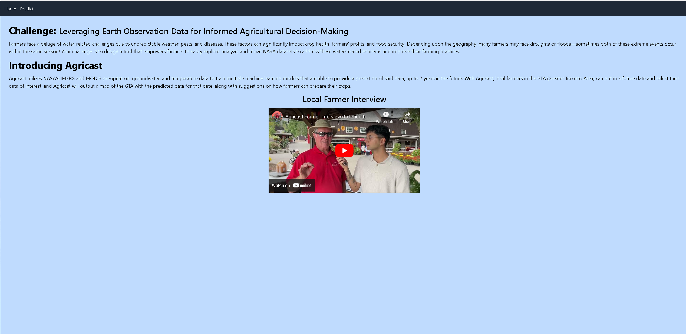
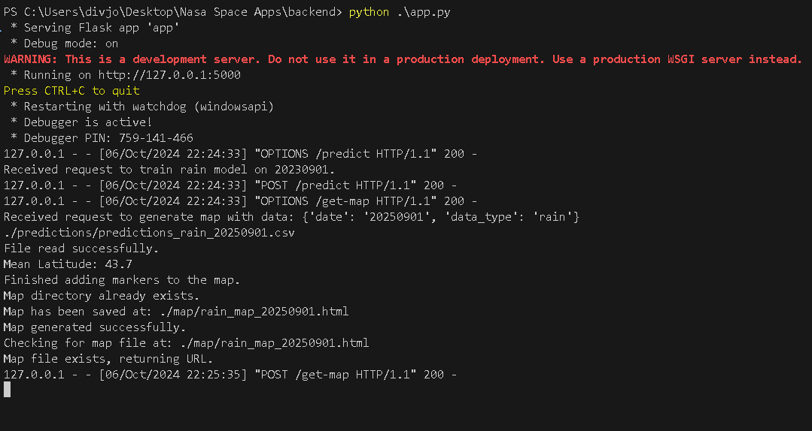
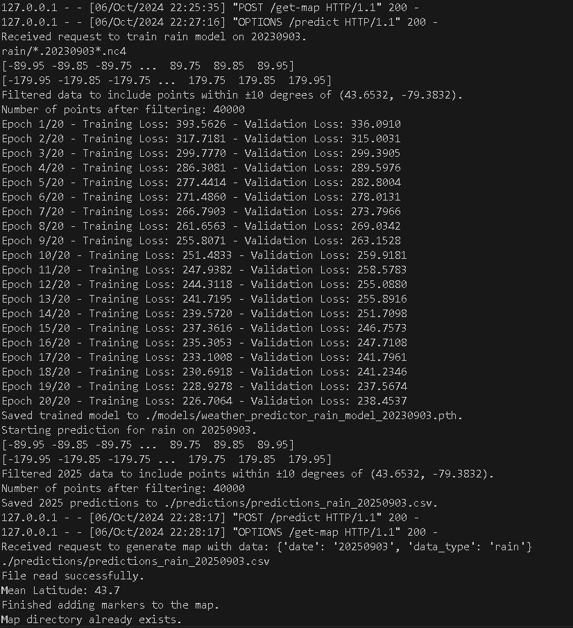
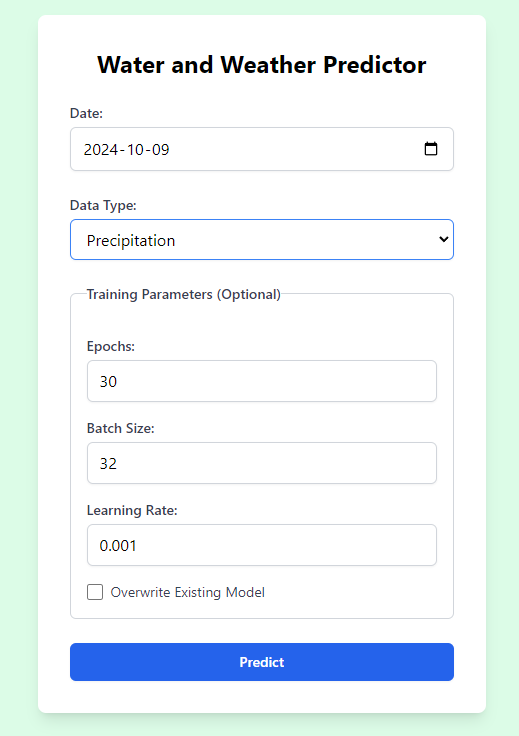

<!-- Improved compatibility of back to top link: See: https://github.com/othneildrew/Best-README-Template/pull/73 -->

<a id="readme-top"></a>

<!-- PROJECT LOGO -->
<br />
<div align="center">

  <h1 align="center">Agricast</h1>

  <p align="center">
    A tool to assist local farmers in the GTA by predicting precipitation, temperature, and ground water levels.
    <br />
    Created for Nasa Space Apps 2024.
    <br />
    <br />
    <a href="https://github.com/othneildrew/Best-README-Template">View Demo</a>
  </p>
</div>

<!-- ABOUT THE PROJECT -->

## About The Project

Agricast utilizes NASA's IMERG and MODIS precipitation, groundwater, and temperature data to train multiple machine learning models that are able to provide a
prediction of said data, up to 2 years in the future. With Agricast, local farmers in the GTA (Greater Toronto Area) can put in a future date
and select their data of interest, and Agricast will output a map of the GTA with the predicted data for that date, along with suggestions
on how farmers can prepare their crops.




<p align="right">(<a href="#readme-top">back to top</a>)</p>

## AI TRAINING

  Our Application takes the datasets from NASA about precipation, temperature and groundwater. It takes the Months from April-November (Summer/Fall/Spring) in 2023 and trains the model using epoch size of 20 and the cordinates around Toronto (GTA).
  The application then predicts the given date (e.g 20250901, September 1st 2025) and uses the model to predict the data type that you input (Temperature, Predcipation, Groundwater). We had plans for then using the prediction to inform farmers about
  meldew warning or irrgation warning to lower costs and prevents crop contamination. We also wanted preciser datasets and largers however the datasets were 6gb for just 6 months and we did not have time to go through the datasets and sort them out ourselves.

  If we had more time and much larger resources and space, we would be able to expand this project into one that would be able to help farmers like Farmer John.
### Built With

- [![React][React.js]][React-url]
- [![Vite][Vite-logo]][Vite-url]
- [![Typescript][Typescript-logo]][Typescript-url]
- [![Python][Python-logo]][Python-url]
- [![Pytorch][Pytorch-logo]][Pytorch-url]

<p align="right">(<a href="#readme-top">back to top</a>)</p>

<!-- GETTING STARTED -->

## Getting Started

We have to note you can't run the code on your local computer simply because the datasets were to huge to input into github as well as the .csv files. You can view the rain dataset on google drive and some .csv file examples. 
You can however clone the project and see everything else!
(The datasets were around 6gb for just ~6 months)
### Prerequisites


### Installation

The machine learning models are available to be downloaded at:

1. Clone the repo
   ```sh
   git clone https://github.com/AltraDiv/NasaSpaceApps.git
   ```
2. Install NPM packages
   ```sh
   npm install
   ```
3. Start Server
   Backend:
   ```sh
   cd backend
   python app.py
   ```
   Frontend:
   ```sh
   cd frontend/agricast
   npm run dev
   ```

<p align="right">(<a href="#readme-top">back to top</a>)</p>

<!-- USAGE EXAMPLES -->

## Usage



<p align="right">(<a href="#readme-top">back to top</a>)</p>

<!-- CONTRIBUTING -->

## Contributors

Matthew Ferreira - ferrem15@mcmaster.ca

Divjot Bhogal - divjotbhogal@gmail.com

<!-- ACKNOWLEDGMENTS -->

## Resources

Use this space to list resources you find helpful and would like to give credit to. I've included a few of my favorites to kick things off!

- [Training Data Used](https://drive.google.com/drive/u/1/folders/1LockJfikBB2l-ySRc0j0YGAKsdcQ6giw)
- [Training Data Source](https://grid.malven.co/)
- [NASA Space Apps Challenge](https://www.spaceappschallenge.org/nasa-space-apps-2024/challenges/leveraging-earth-observation-data-for-informed-agricultural-decision-making/)
- [NASA Space Apps Submission Page](https://www.spaceappschallenge.org/nasa-space-apps-2024/find-a-team/yilonma/?tab=project)
- [Springridge Farm](https://www.springridgefarm.com/)
- [Readme Template](https://github.com/othneildrew/Best-README-Template)

<p align="right">(<a href="#readme-top">back to top</a>)</p>

<!-- MARKDOWN LINKS & IMAGES -->
<!-- https://www.markdownguide.org/basic-syntax/#reference-style-links -->

[contributors-shield]: https://img.shields.io/github/contributors/othneildrew/Best-README-Template.svg?style=for-the-badge
[contributors-url]: https://github.com/othneildrew/Best-README-Template/graphs/contributors
[forks-shield]: https://img.shields.io/github/forks/othneildrew/Best-README-Template.svg?style=for-the-badge
[forks-url]: https://github.com/othneildrew/Best-README-Template/network/members
[stars-shield]: https://img.shields.io/github/stars/othneildrew/Best-README-Template.svg?style=for-the-badge
[stars-url]: https://github.com/othneildrew/Best-README-Template/stargazers
[issues-shield]: https://img.shields.io/github/issues/othneildrew/Best-README-Template.svg?style=for-the-badge
[issues-url]: https://github.com/othneildrew/Best-README-Template/issues
[license-shield]: https://img.shields.io/github/license/othneildrew/Best-README-Template.svg?style=for-the-badge
[license-url]: https://github.com/othneildrew/Best-README-Template/blob/master/LICENSE.txt
[linkedin-shield]: https://img.shields.io/badge/-LinkedIn-black.svg?style=for-the-badge&logo=linkedin&colorB=555
[linkedin-url]: https://linkedin.com/in/othneildrew
[product-screenshot]: images/screenshot.png
[Next.js]: https://img.shields.io/badge/next.js-000000?style=for-the-badge&logo=nextdotjs&logoColor=white
[Next-url]: https://nextjs.org/
[React.js]: https://img.shields.io/badge/React-20232A?style=for-the-badge&logo=react&logoColor=61DAFB
[React-url]: https://reactjs.org/
[Python-logo]: https://img.shields.io/badge/python-3670A0?style=for-the-badge&logo=python&logoColor=ffdd54
[Python-url]: https://www.python.org/
[Vite-Logo]: https://img.shields.io/badge/Vite-646CFF?style=for-the-badge&logo=Vite&logoColor=white
[Vite-url]: https://vite.dev/
[Pytorch-logo]: https://img.shields.io/badge/PyTorch-EE4C2C?style=for-the-badge&logo=pytorch&logoColor=white
[Pytorch-url]: https://pytorch.org/
[Typescript-logo]: https://shields.io/badge/TypeScript-3178C6?logo=TypeScript&logoColor=FFF&style=flat-square
[Typescript-url]: https://www.typescriptlang.org/
